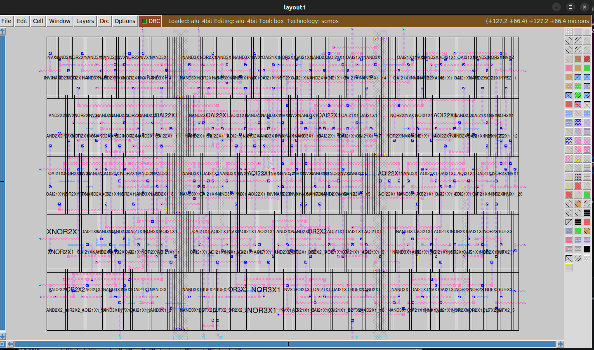

# RTL-to-GDSII Physical Design of a 4-bit ALU


## Project Report

---

## Table of Contents

1. [Abstract](#1-abstract)
2. [Introduction](#2-introduction)
3. [Project Objectives](#3-project-objectives)
4. [Project Specifications](#4-project-specifications)
5. [ALU Architecture](#5-alu-architecture)
6. [RTL Design](#6-rtl-design)
7. [Functional Verification](#7-functional-verification)
8. [Logic Synthesis](#8-logic-synthesis)
9. [Technology Mapping](#9-technology-mapping)
10. [RTL-to-GDSII Flow](#10-rtl-to-gdsii-flow)
11. [Physical Design Environment](#11-physical-design-environment)
12. [Placement](#12-placement)
13. [Routing](#13-routing)
14. [Layout Migration](#14-layout-migration)
15. [Design Rule Check (DRC)](#15-design-rule-check-drc)
16. [Layout Versus Schematic (LVS)](#16-layout-versus-schematic-lvs)
17. [GDSII Generation](#17-gdsii-generation)
18. [Final Results](#18-final-results)
19. [Project File Structure](#19-project-file-structure)
20. [Challenges and Solutions](#20-challenges-and-solutions)
21. [Complete Command Flow](#21-complete-command-flow)
22. [Discussion](#22-discussion)
23. [Future Scope](#23-future-scope)
24. [Conclusion](#24-conclusion)
25. [References](#25-references)
26. [Resume Description](#26-resume-description)

---

# 1. Abstract

This project presents the complete **RTL-to-GDSII physical design implementation of a 4-bit Arithmetic Logic Unit (ALU)** using open-source VLSI design tools.

The ALU was designed using **Verilog HDL** and supports arithmetic and logical operations controlled by a 3-bit operation-selection signal. The design accepts two 4-bit operands along with a carry input and generates a 4-bit result, carry output, and zero flag.

Before physical implementation, the RTL design was functionally verified using **Icarus Verilog**. An exhaustive verification process was performed, resulting in:

```text
Total tests = 2048
Passed tests = 2048
Failed tests = 0
```

Following successful functional verification, the RTL was synthesized using **Yosys** and mapped to the **OSU035 standard-cell technology library**. The synthesized design was then taken through the physical-design stages using **Qflow**, with **GrayWolf** used for placement and **Qrouter** used for routing.

After routing, the design was migrated into a Magic layout database. Physical verification was performed using **Magic DRC** and **Netgen LVS**. The final DRC reported **zero violations**, while LVS reported **zero errors** and confirmed that the extracted and reference circuits matched uniquely.

Finally, the physical design was converted into **GDSII format**, producing the final file:

```text
layout/alu_4bit.gds
```

with a size of approximately **309 KB**.

The project therefore demonstrates a complete open-source digital VLSI physical-design flow from **RTL description to final GDSII layout**.

---

# 2. Introduction

Very Large Scale Integration (VLSI) design involves the implementation of complex electronic systems on a semiconductor chip. A digital circuit is generally described at the Register Transfer Level (RTL), functionally verified, synthesized into a gate-level representation, and then physically implemented on silicon.

The physical-design stage converts the synthesized logical circuit into an actual geometric layout consisting of standard cells, metal interconnections, vias, power structures, and input/output connections.

A simplified digital VLSI implementation flow is:

```text
                 RTL Design
                     │
                     ▼
           Functional Verification
                     │
                     ▼
                Synthesis
                     │
                     ▼
            Technology Mapping
                     │
                     ▼
                 Placement
                     │
                     ▼
                  Routing
                     │
                     ▼
             Layout Generation
                     │
                     ▼
                    DRC
                     │
                     ▼
                    LVS
                     │
                     ▼
                  GDSII
```

In this project, a **4-bit Arithmetic Logic Unit** was selected as the target design.

An ALU is an important component of a processor datapath and performs arithmetic and logical operations on binary operands. Even though the ALU implemented in this project is small, it provides practical exposure to several important VLSI concepts:

* RTL design
* Combinational logic
* Functional verification
* Logic synthesis
* Standard-cell technology mapping
* Physical placement
* Global and detailed routing
* Layout generation
* Design Rule Checking
* Layout Versus Schematic verification
* GDSII generation

The project was implemented using an open-source VLSI toolchain.

---

# 3. Project Objectives

The primary objectives of this project are:

1. To design a functional 4-bit ALU using Verilog HDL.
2. To implement arithmetic and logical operations.
3. To develop an exhaustive functional verification environment.
4. To verify the RTL design using Icarus Verilog.
5. To synthesize the RTL using Yosys.
6. To perform technology mapping using the OSU035 standard-cell library.
7. To perform standard-cell placement using GrayWolf.
8. To perform routing using Qrouter.
9. To generate the physical layout using Magic.
10. To perform Design Rule Check (DRC).
11. To perform Layout Versus Schematic (LVS).
12. To generate the final GDSII layout.
13. To understand the complete RTL-to-GDSII physical-design flow.
14. To create a project suitable for demonstrating practical physical-design knowledge.

---

# 4. Project Specifications

## 4.1 Design Name

```text
alu_4bit
```

## 4.2 Design Type

```text
4-bit Combinational Arithmetic Logic Unit
```

## 4.3 Hardware Description Language

```text
Verilog HDL
```

## 4.4 Target Technology

```text
OSU035 Standard-Cell Technology
```

## 4.5 Main Tools

| Tool           | Purpose                     |
| -------------- | --------------------------- |
| Icarus Verilog | RTL simulation              |
| Yosys          | Logic synthesis             |
| Qflow          | Physical-design flow        |
| GrayWolf       | Placement                   |
| Qrouter        | Routing                     |
| Magic          | Layout and DRC              |
| Netgen         | LVS                         |
| tcsh           | Qflow scripting environment |

---

# 5. ALU Architecture

The 4-bit ALU receives two 4-bit operands and an operation-selection signal.

## 5.1 Inputs

| Signal    |  Width | Description        |
| --------- | -----: | ------------------ |
| `A`       | 4 bits | First operand      |
| `B`       | 4 bits | Second operand     |
| `ALU_Sel` | 3 bits | Operation selector |
| `Cin`     |  1 bit | Carry input        |

## 5.2 Outputs

| Signal |  Width | Description           |
| ------ | -----: | --------------------- |
| `Y`    | 4 bits | ALU result            |
| `Cout` |  1 bit | Carry output          |
| `Zero` |  1 bit | Zero-result indicator |

---

## 5.3 ALU Block Diagram

```text
                 ┌──────────────────────────┐
                 │                          │
 A[3:0] ────────►│                          │
                 │                          │
 B[3:0] ────────►│        4-BIT ALU         │──────► Y[3:0]
                 │                          │
 Cin ───────────►│                          │──────► Cout
                 │                          │
 ALU_Sel[2:0] ─►│                          │──────► Zero
                 │                          │
                 └──────────────────────────┘
```

> **Figure 1: Block diagram of the proposed 4-bit ALU**

---

## 5.4 Supported Operations

The ALU uses the `ALU_Sel` input to select the required operation.

| `ALU_Sel` | Operation | Description             |
| --------- | --------- | ----------------------- |
| `000`     | ADD       | Addition of A and B     |
| `001`     | SUBTRACT  | Subtraction of B from A |
| `010`     | AND       | Bitwise AND             |
| `011`     | OR        | Bitwise OR              |
| `100`     | XOR       | Bitwise XOR             |
| `101`     | NOT       | Bitwise inversion of A  |
| `110`     | INCREMENT | Increment A             |
| `111`     | DECREMENT | Decrement A             |

For addition, the carry input is included:

```text
A + B + Cin
```

The result is represented using:

```text
{Cout, Y}
```

The zero flag indicates whether the final 4-bit output is zero.

---

# 6. RTL Design

The ALU was implemented using synthesizable Verilog HDL.

The top-level module is:

```verilog
module alu_4bit(
    A,
    B,
    ALU_Sel,
    Cin,
    Y,
    Cout,
    Zero
);
```

The design is purely combinational and therefore does not contain any clocked storage elements.

The operation-selection logic is implemented using a `case` structure based on `ALU_Sel`.

A simplified conceptual representation is:

```verilog
always @(*) begin

    Y = 4'b0000;
    Cout = 1'b0;

    case (ALU_Sel)

        3'b000: begin
            // ADD
        end

        3'b001: begin
            // SUBTRACT
        end

        3'b010: begin
            // AND
        end

        3'b011: begin
            // OR
        end

        3'b100: begin
            // XOR
        end

        3'b101: begin
            // NOT
        end

        3'b110: begin
            // INCREMENT
        end

        3'b111: begin
            // DECREMENT
        end

    endcase
end
```

The zero output is generated according to the result:

```text
Zero = 1 when Y = 0000
```

The use of default assignments ensures that the design remains combinational and prevents unintended latch inference.

> **Figure 2: Verilog RTL implementation of the 4-bit ALU**

---

# 7. Functional Verification

Functional verification was performed before starting physical implementation.

The simulator used was:

```text
Icarus Verilog
```

The testbench was designed to exhaustively verify the ALU behavior.

The simulation considered the possible combinations of:

* ALU operands
* Operation selection
* Carry input

The final simulation produced:

```text
=================================
ALL TESTS PASSED!
Total tests = 2048
=================================
```

## 7.1 Verification Summary

| Parameter         | Result |
| ----------------- | -----: |
| Total test cases  |   2048 |
| Passed            |   2048 |
| Failed            |      0 |
| Functional status |   PASS |

The result confirms that the RTL implementation behaved correctly for all test cases included in the exhaustive verification environment.

> **Figure 3: Functional simulation showing 2048/2048 tests passed**

---

# 8. Logic Synthesis

After functional verification, the RTL design was synthesized using **Yosys**.

The purpose of synthesis is to convert the behavioral RTL description into a gate-level representation that can be physically implemented.

The synthesis process involves:

1. RTL parsing
2. Design elaboration
3. Boolean optimization
4. Logic simplification
5. Technology mapping
6. Generation of the mapped netlist

The synthesis script was used to generate the mapped ALU implementation.

The resulting design consisted of standard logic cells from the OSU035 library.

---

# 9. Technology Mapping

Technology mapping converts the generic synthesized logic into cells available in the selected standard-cell library.

The technology used was:

```text
OSU035
```

The library contains standard cells such as:

```text
AND2X1
AND2X2
AOI21X1
AOI22X1
BUFX2
INVX1
INVX2
NAND2X1
NAND3X1
NOR2X1
NOR3X1
OAI21X1
OAI22X1
OR2X1
OR2X2
XNOR2X1
XOR2X1
```

After Qflow synthesis and optimization, the final physical-design representation contained **137 cell instances**.

---

## 9.1 Final Cell Distribution

| Standard Cell |   Count |
| ------------- | ------: |
| `AND2X2`      |       3 |
| `AOI21X1`     |      17 |
| `AOI22X1`     |       3 |
| `BUFX2`       |       6 |
| `INVX1`       |      22 |
| `INVX2`       |       1 |
| `NAND2X1`     |      21 |
| `NAND3X1`     |      17 |
| `NOR2X1`      |      17 |
| `NOR3X1`      |       1 |
| `OAI21X1`     |      22 |
| `OAI22X1`     |       3 |
| `OR2X2`       |       3 |
| `XNOR2X1`     |       1 |
| **Total**     | **137** |

The mapped implementation demonstrates how the high-level RTL operators were converted into physical standard-cell primitives.

> **Figure 4: Yosys/Qflow technology-mapping statistics**

---

# 10. RTL-to-GDSII Flow

The complete flow used in this project was:

```text
┌─────────────────────┐
│    Verilog RTL      │
└──────────┬──────────┘
           │
           ▼
┌─────────────────────┐
│ Functional          │
│ Verification        │
└──────────┬──────────┘
           │
           ▼
┌─────────────────────┐
│ Yosys Synthesis     │
└──────────┬──────────┘
           │
           ▼
┌─────────────────────┐
│ Technology Mapping  │
│ OSU035 Cells        │
└──────────┬──────────┘
           │
           ▼
┌─────────────────────┐
│ GrayWolf Placement  │
└──────────┬──────────┘
           │
           ▼
┌─────────────────────┐
│ Qrouter Routing     │
└──────────┬──────────┘
           │
           ▼
┌─────────────────────┐
│ Magic Layout        │
│ Migration           │
└──────────┬──────────┘
           │
       ┌───┴───┐
       ▼       ▼
     DRC       LVS
       │       │
       └───┬───┘
           ▼
┌─────────────────────┐
│ GDSII Generation    │
└─────────────────────┘
```

> **Figure 5: Complete RTL-to-GDSII physical-design flow**

---

# 11. Physical Design Environment

The physical-design project was created using Qflow.

The project directory was:

```text
4bit_ALU_PD/
└── physical_design/
    └── qflow/
```

The Qflow project used the OSU035 technology:

```text
set techname=osu035
```

The technology directory was:

```text
/usr/share/qflow/tech/osu035
```

Important technology files included:

```text
osu035.magicrc
osu035.par
osu035.prm
osu035.sh
osu035_stdcells.lef
osu035_stdcells.lib
osu035_stdcells.sp
osu035_stdcells.v
SCN4M_SUBM.20.tech
```

The standard-cell GDS library was also added:

```text
osu035_stdcells.gds2
```

This file was required for final GDSII generation.

---

# 12. Placement

Placement is the process of assigning physical locations to the synthesized standard cells inside the chip core.

The placement stage was performed using:

```text
GrayWolf
```

The Qflow placement command used was:

```bash
/usr/lib/qflow/scripts/placement.sh -d . alu_4bit
```

The placement flow successfully generated files such as:

```text
layout/alu_4bit.cel
layout/alu_4bit.def
layout/alu_4bit.pin
layout/alu_4bit.pl1
layout/alu_4bit.pl2
```

The placement process also identified the standard-cell fill cell:

```text
FILL
```

and generated the DEF representation used for subsequent routing.

---

## 12.1 Placement Output

Important generated files:

| File           | Purpose                          |
| -------------- | -------------------------------- |
| `alu_4bit.cel` | GrayWolf placement database      |
| `alu_4bit.def` | Physical design exchange format  |
| `alu_4bit.pin` | Pin placement information        |
| `alu_4bit.pl1` | Placement information            |
| `alu_4bit.pl2` | Additional placement information |

> **Figure 6: Standard-cell placement of the 4-bit ALU**

---

# 13. Routing

Routing establishes physical electrical connections between the placed standard cells.

The router used was:

```text
Qrouter 1.4.71.T
```

The routing command was:

```bash
/usr/lib/qflow/scripts/router.sh . alu_4bit
```

The router successfully completed the routing stages.

The routing output reported:

```text
Stage 1 total routes completed: 320
```

The first Stage-3 round reported:

```text
Stage 3 total routes completed: 612
```

The second Stage-3 round reported:

```text
Stage 3 total routes completed: 904
```

Most importantly:

```text
Final: No failed routes!
```

---

## 13.1 Routing Summary

| Parameter       | Result |
| --------------- | -----: |
| Stage 1 routes  |    320 |
| Stage 3 Round 1 |    612 |
| Stage 3 Round 2 |    904 |
| Failed routes   |      0 |
| Final status    |   PASS |

The router generated:

```text
layout/alu_4bit.def
```

and:

```text
layout/alu_4bit.rc
```

The RC file contains extracted routing resistance/capacitance information.

> **Figure 7: Final routed layout showing standard cells and metal interconnections**

---

# 14. Layout Migration

After placement and routing, the routed design was migrated into a Magic layout database.

The migration command was:

```bash
/usr/lib/qflow/scripts/migrate.sh . alu_4bit
```

Magic processed the routed DEF file and generated the physical layout representation.

The migration output reported:

```text
Processed 171 subcell instances total.
Processed 20 pins total.
Processed 149 nets total.
```

The following files were generated:

```text
layout/alu_4bit.mag
layout/alu_4bit.lef
layout/alu_4bit.spice
```

---

## 14.1 Generated Layout Files

| File             | Description             |
| ---------------- | ----------------------- |
| `alu_4bit.mag`   | Magic physical layout   |
| `alu_4bit.lef`   | Layout abstract         |
| `alu_4bit.spice` | Extracted SPICE netlist |
| `alu_4bit.def`   | Routed physical design  |

The `.mag` file became the primary layout database used for physical verification.

> **Figure 8: Magic physical layout of the 4-bit ALU**

---

# 15. Design Rule Check (DRC)

## 15.1 Purpose of DRC

Design Rule Check verifies whether the physical layout follows the geometric constraints defined by the selected fabrication technology.

DRC checks can include:

* Minimum metal width
* Minimum spacing
* Via dimensions
* Metal overlap
* Layer spacing
* Contact rules
* Other technology-specific geometric constraints

The DRC was performed using Magic.

The command used was:

```bash
/usr/lib/qflow/scripts/drc.sh . alu_4bit
```

The final DRC result was:

```text
drc = 0
```

---

## 15.2 DRC Result

| Parameter      | Result |
| -------------- | -----: |
| DRC violations |      0 |
| DRC status     |   PASS |

The final physical layout therefore contained **zero reported DRC violations**.

> **Figure 9: DRC result showing `drc = 0`**

---

# 16. Layout Versus Schematic (LVS)

## 16.1 Purpose of LVS

Layout Versus Schematic verifies whether the physical layout implements the same electrical circuit as the reference netlist.

The LVS process compares:

```text
Reference Netlist
        ↕
Extracted Layout Netlist
```

The LVS tool used in this project was:

```text
Netgen
```

The command was:

```bash
/usr/lib/qflow/scripts/lvs.sh . alu_4bit
```

---

## 16.2 LVS Results

The comparison reported:

```text
Circuit 1 contains 137 devices
Circuit 2 contains 137 devices
```

and:

```text
Circuit 1 contains 151 nets
Circuit 2 contains 151 nets
```

The final result was:

```text
Netlists match uniquely.
Result: Circuits match uniquely.
```

The Qflow LVS summary reported:

```text
LVS reports no net, device, pin, or property mismatches.

Total errors = 0
```

---

## 16.3 LVS Summary

| Parameter           | Reference | Extracted | Result |
| ------------------- | --------: | --------: | ------ |
| Devices             |       137 |       137 | Match  |
| Nets                |       151 |       151 | Match  |
| Device mismatches   |         0 |         0 | PASS   |
| Net mismatches      |         0 |         0 | PASS   |
| Pin mismatches      |         0 |         0 | PASS   |
| Property mismatches |         0 |         0 | PASS   |
| Total errors        |         — |         — | **0**  |

This confirms that the physical layout corresponds to the synthesized electrical design.

> **Figure 10: LVS result showing `Netlists match uniquely` and `Total errors = 0`**

---

# 17. GDSII Generation

GDSII is the standard layout data format used to represent the physical geometry of an integrated circuit.

The final GDSII generation required the OSU035 standard-cell GDS library:

```text
osu035_stdcells.gds2
```

The library was added to:

```text
/usr/share/qflow/tech/osu035/
```

After installing the required library, the GDSII generation was completed successfully.

The final output was:

```text
layout/alu_4bit.gds
```

The final file size was approximately:

```text
309 KB
```

---

## 17.1 Final GDSII Result

| Parameter   | Result                 |
| ----------- | ---------------------- |
| Design      | `alu_4bit`             |
| Output file | `alu_4bit.gds`         |
| Format      | GDSII                  |
| File size   | ~309 KB                |
| Status      | Successfully generated |

The GDSII file represents the final physical layout of the 4-bit ALU.

> **Figure 11: Final GDSII file generated by the physical-design flow**

---

# 18. Final Results

The complete project results are summarized below.

| Category                       |    Result |
| ------------------------------ | --------: |
| Design                         | 4-bit ALU |
| Operations                     |         8 |
| Functional tests               |      2048 |
| Tests passed                   |      2048 |
| Tests failed                   |         0 |
| Standard-cell technology       |    OSU035 |
| Physical-design cell instances |       137 |
| LVS devices                    |       137 |
| LVS nets                       |       151 |
| Routing failures               |         0 |
| DRC violations                 |         0 |
| LVS errors                     |         0 |
| Final GDSII size               |   ~309 KB |

---

## 18.1 Overall Project Status

```text
┌──────────────────────────────┬──────────┐
│ RTL Design                  │   PASS   │
├──────────────────────────────┼──────────┤
│ Functional Verification     │   PASS   │
├──────────────────────────────┼──────────┤
│ Logic Synthesis             │   PASS   │
├──────────────────────────────┼──────────┤
│ Technology Mapping          │   PASS   │
├──────────────────────────────┼──────────┤
│ Placement                   │   PASS   │
├──────────────────────────────┼──────────┤
│ Routing                     │   PASS   │
├──────────────────────────────┼──────────┤
│ Layout Migration            │   PASS   │
├──────────────────────────────┼──────────┤
│ DRC                         │   PASS   │
├──────────────────────────────┼──────────┤
│ LVS                         │   PASS   │
├──────────────────────────────┼──────────┤
│ GDSII Generation            │   PASS   │
└──────────────────────────────┴──────────┘
```

---

# 19. Project File Structure

The final project can be organized as:

```text
4bit_ALU_PD/
│
├── rtl/
│   └── alu.v
│
├── tb/
│   └── alu_tb.v
│
├── sim/
│   ├── alu_sim
│   └── alu.vcd
│
├── synthesis/
│   ├── alu.ys
│   └── alu_mapped.v
│
└── physical_design/
    │
    └── qflow/
        │
        ├── source/
        │   ├── alu.v
        │   ├── alu_4bit.ys
        │   ├── alu_4bit.blif
        │   ├── alu_4bit_mapped.blif
        │   ├── alu_4bit.rtl.v
        │   ├── alu_4bit.rtlnopwr.v
        │   ├── alu_4bit.rtlbb.v
        │   ├── alu_4bit.spc
        │   └── alu_4bit.xspice
        │
        ├── layout/
        │   ├── alu_4bit.cel
        │   ├── alu_4bit.cfg
        │   ├── alu_4bit.def
        │   ├── alu_4bit.info
        │   ├── alu_4bit.lef
        │   ├── alu_4bit.mag
        │   ├── alu_4bit.pin
        │   ├── alu_4bit.pl1
        │   ├── alu_4bit.pl2
        │   ├── alu_4bit.rc
        │   ├── alu_4bit.spice
        │   └── alu_4bit.gds
        │
        ├── log/
        │   ├── synth.log
        │   ├── place.log
        │   ├── route.log
        │   ├── drc.log
        │   ├── lvs.log
        │   └── migrate.log
        │
        ├── project_vars.sh
        ├── qflow_vars.sh
        ├── qflow_exec.sh
        └── alu_4bit.par
```

---

# 20. Challenges and Solutions

## 20.1 Qflow Project Setup

Initially, Qflow could not locate the expected source and log directories.

### Problem

```text
Error: Verilog source file cannot be found
```

### Solution

The required project structure was created:

```text
source/
layout/
log/
```

and the Qflow configuration files were corrected.

---

## 20.2 tcsh Configuration Error

During project setup, Qflow reported:

```text
Missing '}'
```

This was caused by incorrect configuration syntax in the Qflow project files.

The configuration was checked using:

```bash
tcsh -n project_vars.sh
tcsh -n qflow_vars.sh
tcsh -n qflow_exec.sh
```

After correcting the configuration, the Qflow synthesis flow proceeded successfully.

---

## 20.3 BLIF File Location

The placement script initially attempted to locate the synthesized BLIF in the wrong directory.

The project variables were corrected so that the synthesis and physical-design stages referenced the same project paths.

The correct BLIF was:

```text
source/alu_4bit.blif
```

---

## 20.4 Placement Log Issue

The placement stage initially produced:

```text
tee: ./log/place.log: No such file or directory
```

The log directory was recreated and the Qflow project paths were corrected.

After correction, placement successfully completed.

---

## 20.5 Initial DRC Attempt

The first DRC attempt occurred before a valid Magic layout database was available.

Magic reported:

```text
File alu_4bit.mag couldn't be read
```

The migration stage was subsequently executed to create:

```text
layout/alu_4bit.mag
```

DRC was then rerun.

The final DRC result was:

```text
drc = 0
```

---

## 20.6 Missing Standard-Cell GDS Library

The OSU035 technology directory initially did not contain:

```text
osu035_stdcells.gds2
```

The file was located in the installed technology resources and copied into:

```text
/usr/share/qflow/tech/osu035/
```

After this correction, GDSII generation succeeded.

---

# 21. Complete Command Flow

The major commands used during the project are listed below.

## 21.1 RTL Simulation

```bash
iverilog -o sim/alu_sim rtl/alu.v tb/alu_tb.v
```

```bash
vvp sim/alu_sim
```

Expected result:

```text
=================================
ALL TESTS PASSED!
Total tests = 2048
=================================
```

---

## 21.2 Yosys Synthesis

```bash
yosys synthesis/alu.ys
```

---

## 21.3 Qflow Synthesis

```bash
qflow -T osu035 -p . synthesize alu_4bit
```

---

## 21.4 Placement

```bash
/usr/lib/qflow/scripts/placement.sh -d . alu_4bit
```

---

## 21.5 Routing

```bash
/usr/lib/qflow/scripts/router.sh . alu_4bit
```

---

## 21.6 Migration

```bash
/usr/lib/qflow/scripts/migrate.sh . alu_4bit
```

---

## 21.7 DRC

```bash
/usr/lib/qflow/scripts/drc.sh . alu_4bit
```

---

## 21.8 LVS

```bash
/usr/lib/qflow/scripts/lvs.sh . alu_4bit
```

---

## 21.9 GDSII Generation

```bash
/usr/lib/qflow/scripts/gdsii.sh . alu_4bit
```

---

## 21.10 Viewing the Magic Layout

```bash
magic -T osu035 layout/alu_4bit.mag
```

---

# 22. Discussion

The project demonstrates how a simple RTL description can be transformed into an actual physical layout through a sequence of automated VLSI implementation stages.

At the RTL level, the ALU is represented using behavioral Verilog constructs. The simulator verifies the logical behavior of the design.

During synthesis, the behavioral description is converted into a gate-level implementation. Technology mapping then replaces generic logic with physical standard cells available in the OSU035 library.

Placement determines the physical location of these cells, while routing creates the metal connections between them.

The generated layout is then subjected to physical verification.

The successful DRC result indicates that the generated layout satisfies the applicable geometric design rules.

The successful LVS result is particularly important because it demonstrates that the physical implementation and the reference netlist represent the same electrical circuit.

Finally, the successful generation of the GDSII file completes the RTL-to-GDSII flow.

Thus, the project provides practical exposure to both **front-end design** and **back-end physical implementation**.

---

# 23. Future Scope

Although the current project successfully completes the RTL-to-GDSII flow, several improvements can be added.

## 23.1 Static Timing Analysis

Static Timing Analysis can be incorporated to determine:

* Critical path
* Maximum operating frequency
* Propagation delay
* Setup time
* Hold time

---

## 23.2 Power Analysis

Power analysis can be performed to estimate:

* Dynamic power
* Leakage power
* Switching power
* Total power consumption

---

## 23.3 Area Optimization

The design can be optimized to reduce:

* Standard-cell area
* Routing area
* Core area

---

## 23.4 Timing Optimization

High-drive standard cells can be selectively used on critical paths to improve timing.

For example:

```text
INVX1 → INVX2
```

or:

```text
BUFX2 → BUFX4
```

could be explored where appropriate.

---

## 23.5 Power Optimization

Low-power implementation techniques could be investigated, including:

* Reduced switching activity
* Logic restructuring
* Cell sizing
* Power-aware synthesis

---

## 23.6 Post-Layout Simulation

The extracted RC information can be used for post-layout simulation and timing analysis.

This would provide a more realistic representation of circuit behavior after physical implementation.

---

## 23.7 Larger Processor Datapath

The ALU can be expanded into a larger processor datapath containing:

```text
ALU
+
Register File
+
Multiplexer
+
Control Unit
+
Program Counter
```

This could eventually lead to a complete processor physical-design project.

---

# 24. Conclusion

The project successfully implemented a complete **RTL-to-GDSII physical-design flow for a 4-bit Arithmetic Logic Unit** using open-source VLSI tools.

The design was created in Verilog HDL and functionally verified using an exhaustive testbench. The verification achieved:

```text
2048 tests passed
2048 total tests
0 failures
```

The verified RTL was synthesized using Yosys and mapped to the OSU035 standard-cell library. The resulting design contained **137 physical cell instances**.

The physical-design stage was then completed using Qflow, GrayWolf and Qrouter. Placement was successfully completed, followed by routing with:

```text
Final: No failed routes!
```

The routed design was migrated into Magic and subjected to physical verification.

The final DRC result was:

```text
drc = 0
```

indicating zero reported design-rule violations.

LVS verification produced:

```text
Circuit 1 contains 137 devices
Circuit 2 contains 137 devices

Circuit 1 contains 151 nets
Circuit 2 contains 151 nets

Netlists match uniquely.
Total errors = 0
```

This confirms that the physical layout correctly represents the intended synthesized circuit.

Finally, the design was successfully converted into GDSII format:

```text
layout/alu_4bit.gds
```

with a size of approximately **309 KB**.

Overall, the project provided hands-on experience with the complete digital VLSI implementation flow:

```text
RTL
 ↓
Simulation
 ↓
Synthesis
 ↓
Technology Mapping
 ↓
Placement
 ↓
Routing
 ↓
Layout
 ↓
DRC
 ↓
LVS
 ↓
GDSII
```

The project therefore demonstrates practical knowledge of **digital design, synthesis, standard-cell physical design, verification and GDSII generation**, making it a strong introductory physical-design project.

---

# 25. References

1. **Yosys Open SYnthesis Suite** — RTL synthesis and technology mapping.
2. **Qflow** — Open-source digital physical-design flow.
3. **Magic VLSI Layout Tool** — Layout generation, editing and physical verification.
4. **Netgen** — LVS and netlist comparison.
5. **GrayWolf** — Standard-cell placement.
6. **Qrouter** — Detailed routing.
7. **OSU035 Standard-Cell Library** — Standard-cell technology files used for implementation.
8. **Icarus Verilog** — Verilog simulation and functional verification.

---


## One-Line Version

> **Implemented a complete RTL-to-GDSII flow for a 4-bit ALU using Verilog, Yosys, Qflow, GrayWolf, Qrouter, Magic and Netgen, achieving 2048/2048 functional tests, zero DRC/LVS errors and successful GDSII generation.**

---

# Appendix A — Important Project Statistics

```text
DESIGN
------
Design              : 4-bit ALU
Technology           : OSU035
HDL                  : Verilog

FUNCTIONAL
----------
Total tests          : 2048
Passed               : 2048
Failed               : 0

PHYSICAL DESIGN
---------------
Cell instances       : 137
Reference devices    : 137
Extracted devices    : 137

Reference nets       : 151
Extracted nets       : 151

ROUTING
-------
Failed routes        : 0

DRC
---
Violations           : 0

LVS
---
Device mismatches    : 0
Net mismatches       : 0
Pin mismatches       : 0
Property mismatches  : 0
Total errors         : 0

FINAL OUTPUT
------------
GDSII file           : alu_4bit.gds
GDSII size           : ~309 KB
```

---
## Final Layout


